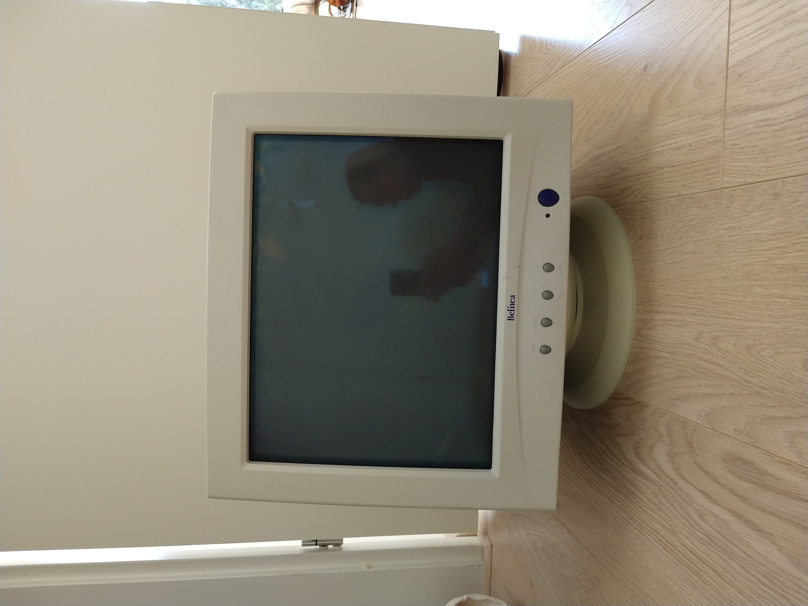
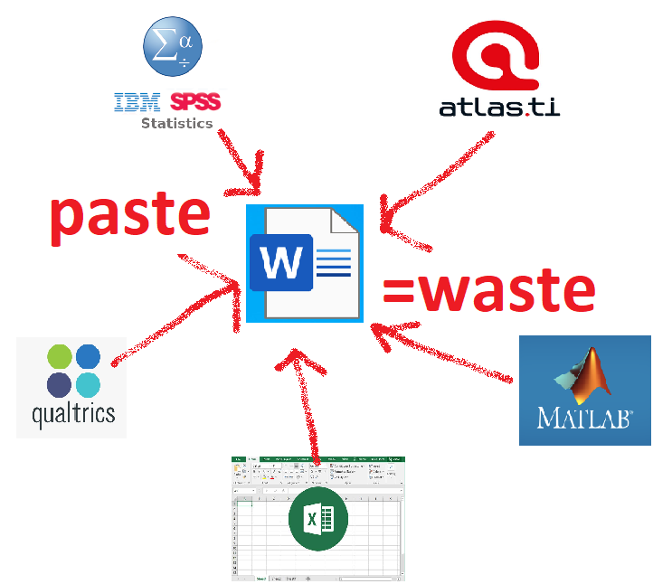
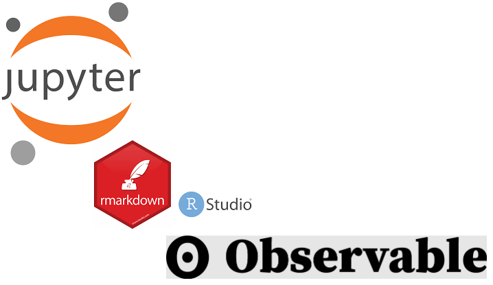

# ROCK, PAPER, ~~SCISSORS~~ SCIENCE NOTEBOOKS

How the very first rock hard science documents were made … 🛈[CartoonStock](https://www.cartoonstock.com/search?type=images&keyword=backup&page=4&expanded=CS370071)🛈

… and delivered to readers. 🛈[e-mail sent](https://www.toonpool.com/cartoons/Send%20email_38040)🛈

---

Luckily lighter materials were soon found … 🛈[e-mail sent](https://www.pngitem.com/middle/hTooJT_heart-we-it-paper-airplane-white-clipart-paper/)🛈

… easily stained however. 🛈[CC](https://pngset.com/download-free-png-elnos)🛈

  

Shit makes inventful though … <!---->[🛈CC,vector,needs blood trace🛈](https://freesvg.org/hand-with-a-quill)

… with contraptions for lousy scriblers … [🛈WikiCommons🛈](https://commons.wikimedia.org/wiki/File:Remington_typewriter_1907_(03).jpg)

… later shielding against bird droppings … <!--
-->🛈Ruud🛈

… and hiding most of the typewriter. <!---->🛈Ruud🛈

---

Then digitalization brought limitless possibilities … 🛈[Shutterstock](https://www.shutterstock.com/image-photo/white-cloud-blue-sky-111668297)🛈

… but physical paper (simulation) habits stayed … 🛈brand🛈

… not using the hyper-connected data-driven interactivity of the web. 🛈??🛈

  

###### The old habits' troubles are non-i̲n̲t̲e̲r̲o̲p̲e̲r̲a̲b̲l̲e̲``*``content-types …
- Losing style Copy Styled text, Paste plain text
- Losing direct edit, search, index. Copy text within visual, Paste raster image
- Losing sharpness Add arrow. Copy vector image, Paste pixelated raster image
- Losing interactivity, movement and sound Copy video/animation/InteractiveVisual, Paste static raster image

  

… and losing context and process, thereby **KILLING REPRODUCIBILITY**.
- Unrepairable manual errors Not copying what was meant to be copied
- No experimenting. How would the output be different if this value changed?
- No auto-updating. If the original data changed, it wouldn't change here
- File edits less consistently manageable``**``. Show how B never sees fix by A and then overwrites it

  

In other words: 🛈Ruud/brands🛈

---

# EMBED YOUR DATA SCIENCE IN A WEB-POWERED NOTEBOOK INSTEAD!
We all know hyperlinks to manually click from one page to the next, but web addresses (or URLs) can do much more. Algorithms created by computer programmers for example use URLs to refer to up-to-date input data. And now there's a way to edit and run these algorithms (aka **Code**), plus show their output (often **Plot**) within your **Text** in so-called Electronic Lab Notebooks. So where shared documents like Google Docs and Word/Teams are famous for cooperating among writers, these notebooks enable adding programmers.
🛈[image](https://subscription.packtpub.com/book/data/9781789800265/1/ch01lvl1sec07/launching-a-jupyter-notebook), CC, [license](https://github.com/temporaer/tutorial_ml_gkbionics/blob/master/LICENSE)🛈
## *Especially NON-techies :heart: this, because without being forced to code themselves, they have short feedback cycles with their techy colleagues (or support staff) and after a while often start some coding themselves too.*
As these notebooks are built on web technology, you can include/embed almost anything found on the web. The helpful communities around them have also created all sorts of things to extend them, so many of your "wouldn't it be nice if …"-wishes are already implemented and available.

**JUST TRY IT WITH YOUR TEAM**: For **open science** reasons, my order of preference is:
🛈Ruud/brands🛈

Your work can then also be exported to both dynamic (dashboards, web apps, etc.) and static formats (e.g. stone tablets now named PDF).

ENJOY!

---

``*``: Part of that problem is fixed by using open file formats. To help that, [FAIR files listing](https://github.com/steltenpower/FAIRfilesListing) was thought up. Looking to have it implemented everywhere for you, so help out!

``**``: make sure to look into the de facto standard for version control (of collections of files to be edited by groups): [git](https://thenewstack.io/tutorial-git-for-absolutely-everyone/)

A more technically detailed article in Nature: ["Cut the tyranny of copy-and-paste with these coding tools"](https://www.nature.com/articles/d41586-022-00563-z), 28 February 2022

What this fundamentally means for the quality and range of science: ["The scientific paper is obsolete"](https://www.theatlantic.com/science/archive/2018/04/the-scientific-paper-is-obsolete/556676/), The Atlantic, APRIL 5, 2018

["eLife launches Executable Research Articles for publishing computationally reproducible results"](https://elifesciences.org/for-the-press/eb096af1/elife-launches-executable-research-articles-for-publishing-computationally-reproducible-results), Aug 24, 2020

Thanks to everybody honestly pointing me at nerd speak to get rid off in the draft versions or motivating me to keep going to make it just right.

END

---

A 1080p YouTube clip is under development with the above as introduction, followed by some actual (not too technically overwhelming) notebook-based cooperation. Suggestions are very welcome. Help out!

TODO:
- The 8 images explaining the problem of cut/copy/paste will be arranged into 2 pages each with a 2x2 grid of images.
