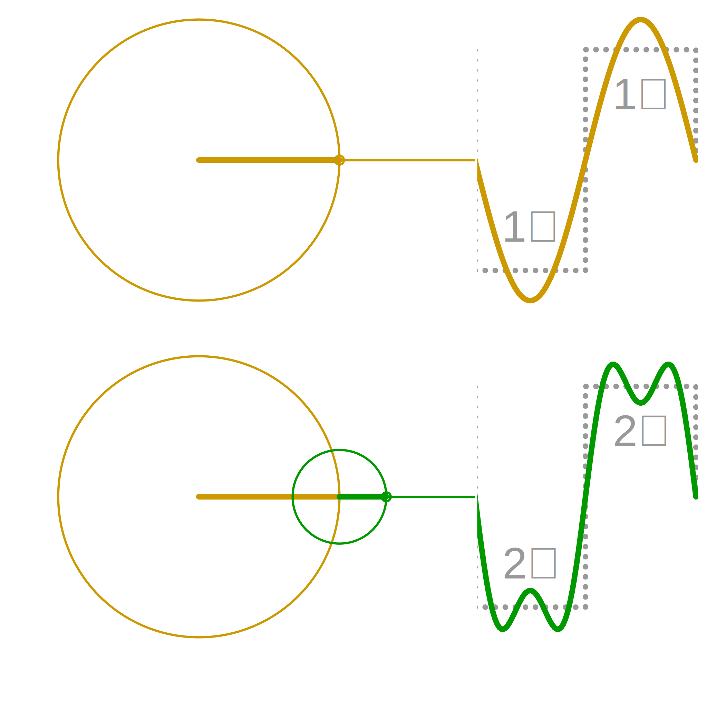
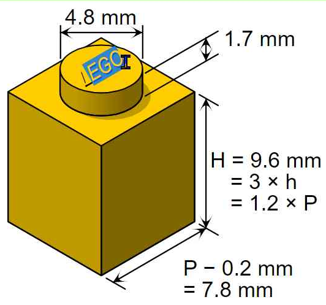
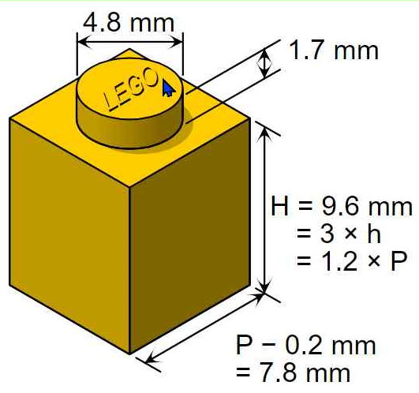

# ROCK, PAPER, ~~SCISSORS~~ [SCIENCE NOTEBOOKS](#embed-your-data-science-in-web-powered-notebooks) 
(or how most of your work is actually still rather constrained in sheets of paper 
&nbsp;&nbsp;and what you win by going proper digital in electronic notebooks)

## ROCK
<table><tr>
  <td width="50%">Hard science,</td>
  <td width="50%">delivered to readers.</td>
</tr><tr>
  <td width="50%"></td>
  <td width="50%"></td>
</tr></table>

## PAPER
<table><tr><td width="50%">
Lighter material found,
  </td><td width="50%">
  easily stained.
  </td></tr><tr><td width="50%">

  </td><td width="50%">

  </td></tr></table>

## PAPER TOOLS
<table><tr><td width="50%">
Shit makes bloody inventful though,
  </td><td width="50%">with contraptions for lousy scriblers,
  </td></tr><tr><td width="50%">
  
  <!---->
  </td><td width="50%">
  
  </td></tr><tr><td width="50%">
later shielding against bird droppings
  </td><td width="50%">
and hiding most of the typewriter.
  </td></tr><tr><td width="50%">
  
  </td><td width="50%">
  
  </td></tr></table>

## PAPER SIMULATION
<table><tr><td>
Then digitalization brought limitless possibilities,
  </td><td>but physical paper (simulation) habits stayed,
  </td></tr><tr><td>
  
  </td><td>
  
  </td></tr><tr><td></td><td>
not using the hyper-connected data-driven interactivity of&nbsp;the&nbsp;web. 
  
  </td></tr></table>

## LOSING&nbsp;INFORMATION with copy-paste:disappointed: (the old habits' troubles are non-i̲n̲t̲e̲r̲o̲p̲e̲r̲a̲b̲l̲e̲¹content-types)
<table><tr>
  <td colspan="2" width="50%">Losing interactivity, animation and sound.</td>
  <td colspan="2" width="50%">Losing direct edit, search, index.</td>
</tr><tr>
  <td width="25%"></td>
  <td width="25%"></td>
  <td width="25%"></td>
  <td width="25%"></td>
</tr><tr>
  <td colspan="2" width="50%">Losing sharpness.</td>
  <td colspan="2" width="50%">Losing style.</td>
</tr><tr>
  <td colspan="2" width="50%"></td>
  <td width="25%"></td>
  <td width="25%">&nbsp;&nbsp;&nbsp;&nbsp;<b>AS</b></td>
</tr></table>

## :construction: LOSING&nbsp;PROCESS with copy-paste:angry: (losing context is **LOSING:skull:REPRODUCIBILITY**)
<table><tr><td width="50%">
Unrepairable manual errors.
  </td><td width="50%">
  No experimenting.
  </td></tr><tr><td width="50%">
  Instead of copying 
  "<b>.12</b>" 
you copied 
  "<b>12</b>" 
  or 
  "<b>12 </b>"
  </td><td width="50%">
  
  </td></tr><tr><td width="50%">
No auto-updating (not immediately, nor on page refresh).
  </td><td width="50%">
File edits less consistently manageable².
  </td></tr><tr><td width="50%">
   
  <i>(Image to be created showing: 
    There's a new (version of the) input file, but you're still using the old ... )</i>
  </td><td width="50%">
   
  <i>(Image to be created showing: 
    Change table with one app, forget to update chart with other app. Inconsistency introduced.)</i>
  </td></tr></table>

## CUT THE HABIT OF COPY:scissors:PASTE

## EMBED YOUR (DATA) SCIENCE IN WEB-POWERED NOTEBOOKS!
We all know hyperlinks to manually click from one page to the next, but web addresses (or URLs) can do much more. Algorithms created by computer programmers for example use URLs to refer to up-to-date input data³. And now there's a way to edit and run these algorithms (aka **Code**), plus show their output (often **Plot**) within your **Text** in so-called Electronic Lab Notebooks.

So where shared documents like Google Docs and Word/Teams are famous for cooperating among writers, these notebooks enable adding programmers.

## WHY ESPECIALLY NON-TECHIES :heart: THIS
Without being forced to code yourself, you can have shorter feedback cycles with your techy colleagues (or support staff). After a while however, many do make their first code edits.

As these notebooks are built on web technology, you can include/embed almost anything found on the web⁴. The helpful communities around them have also created all sorts of things to extend them, so many of your "wouldn't it be nice if …"-wishes are already implemented and available. Plus you can still use any application outside the notebook, while using the flow of the notebook to coordinate, for example: call an outside script to add a manual overlay, or get notified that after the last input change no new file was saved yet for the output of a manual step.

## GO TRY IT WITH YOUR TEAM
As your team probably shares files behind a login, it's good to know you can have notebooks within that same environment too, which will also speed things up and depending the server make heavy computation on big data possible.
R and Python are the most popular programming languages in data science nowadays, and <a href="https://carpentries.org">carpentries.org</a> lessons can give you a useful start in a day or two. There are many different notebooks and derivatives, but here are 3 popular ones and the languages they support:
<table><tr><td>
  </td><td><b>Ju</b>lia <b>Pyt</b>hon <b>R</b> ~100 other
  </td></tr><tr><td>
<!--  
  </td></tr><tr><td> -->
  </td><td>R Python
  </td></tr><tr><td>
  </td><td>JavaScript
  </td></tr></table>

Now go talk to your research supporter about it!
If (s)he tells you to provide PDFs instead, explain it can export to formats like dashboards, web apps, presentation 'sheets', and static formats including that stone tablet format.

ENJOY!

---

## NOTES
¹: Part of that problem is fixed by using open file formats (e.g. HTML, SVG, ePub, Open Document Format, frictionless data, Linked Data), where implementations in popular open source software usually shine. To help the end user with both, [FAIR files listing](https://github.com/steltenpower/FAIRfilesListing) was thought up. Looking to have it implemented everywhere for you, so help out!

²: make sure to look into the de facto standard for version control (of collections of files to be edited by groups): [git](https://thenewstack.io/tutorial-git-for-absolutely-everyone/)

³: Working more data-driven will get errors and inefficient information structures noticed more often and earlier. Personal responsibility, in-context feedback options throughout the organisation and automatic data quality checks in several places are a necessity for grown-up efficient information management. Start with spell checkers everywhere and keep growing.

⁴	: If your institution really wants open science, it also provides everybody with both a public and an internal way of (web)serving the most succesfull open format (HTML), right? RIGHT?

## FURTHER READING
- What this fundamentally means for the quality and range of science: ["The scientific paper is obsolete"](https://www.theatlantic.com/science/archive/2018/04/the-scientific-paper-is-obsolete/556676/), The Atlantic, APRIL 5, 2018
- ["eLife launches Executable Research Articles for publishing computationally reproducible results"](https://elifesciences.org/for-the-press/eb096af1/elife-launches-executable-research-articles-for-publishing-computationally-reproducible-results), Aug 24, 2020
- A more technically detailed article in Nature: ["Cut the tyranny of copy-and-paste with these coding tools"](https://www.nature.com/articles/d41586-022-00563-z), 28 February 2022

## THE END
(Thanks to everybody honestly pointing me at nerd speak to get rid off in the draft versions or motivating me to keep going to make it just right.)

## TODO
- Fix images, certainly those in "LOSING INFORMATION" and "LOSING PROCESS". Also buy stock photos, improve own photos
- Create a 1080p YouTube clip with the above visual reasoning as introduction, followed by some actual (not too technically overwhelming, showing sliders for sure) notebook-based cooperation (have footage? want to create?)
- Turn this itself in [a notebook to present as sheets](https://medium.com/@mjspeck/presenting-code-using-jupyter-notebook-slides-a8a3c3b59d67)
- Improve layout in the sheets

## SOURCES
TABLET <a href="https://www.cartoonstock.com/search?type=images&keyword=backup&page=4&expanded=CS370071">CartoonStock</a>
 
LAUNCH <a href="https://www.toonpool.com/cartoons/Send%20email_38040">[e-mail sent]</a>

PLANE <a href="https://www.pngitem.com/middle/hTooJT_heart-we-it-paper-airplane-white-clipart-paper/">[e-mail sent]</a>
 
POOP <a href="https://pngset.com/download-free-png-elnos">CC BY-NC 4.0</a>

FEATHER <a href="https://freesvg.org/hand-with-a-quill">CC0</a>,vector,needs trace of <a href="https://htmlcolorcodes.com/colors/blood-red/">blood</a>
 
TYPEWRITER <a href="https://commons.wikimedia.org/wiki/File:Remington_typewriter_1907_(03).jpg">CC-SA</a>
 
SCREEN Ruud≈ CC0
 KEYBOARD Ruud≈ CC0
 
CLOUD <a href="https://www.maxpixel.net/Sky-Cloud-Blue-Heaven-Heavenly-White-Background-1551174">CC0</a>
 
CUT&PASTE brand
 
DEAD-PAPERS ???

FOURIER <a href="https://commons.wikimedia.org/wiki/File:Fourier_series_square_wave_circles_animation.svg">CC-SA</a>
 
LEGO <a href="https://commons.wikimedia.org/wiki/File:Lego_dimensions.svg">CC-SA</a>
 
UNSHARP ???
 
NASA <a href="https://commons.wikimedia.org/wiki/File:NASA_Wormball_logo.svg">PD</a>≈ CC0

UNDETECTABLE text instead of image
 
NO-EXPERIMENTING <a href="https://www.castoriscausa.com/index2.html">CC-SA</a>
 
NO-UPDATING  *image needed*
 
NO-FILES-CONSISTENCY *image needed*

PASTEWASTE Ruud/brands

NOTEBOOK [image](https://subscription.packtpub.com/book/data/9781789800265/1/ch01lvl1sec07/launching-a-jupyter-notebook), [CC0](https://github.com/temporaer/tutorial_ml_gkbionics/blob/master/LICENSE)

JUPYTER <a href="https://commons.wikimedia.org/wiki/File:Jupyter_logo.svg">BSD</a>
 
RsTuDiO <a href="https://www.rstudio.com/about/logos/">brand</a>
 
RMARKDOWN <a href="https://github.com/rstudio/hex-stickers/">CC0</a>
 
OBSERVABLE brand
